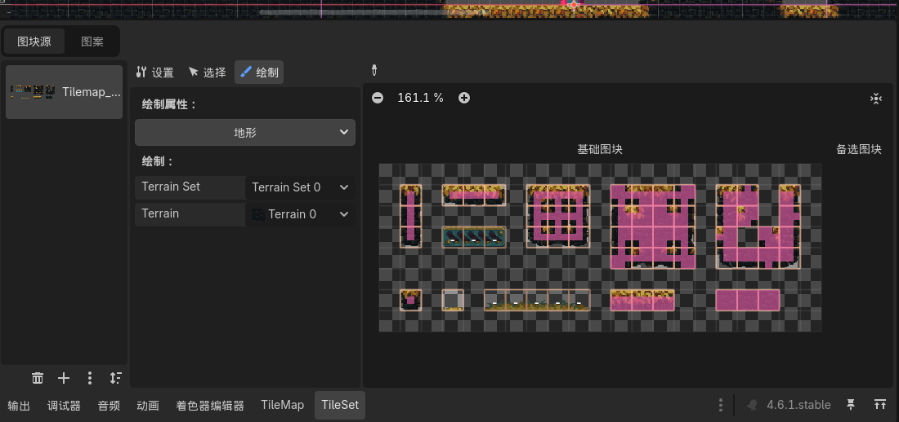
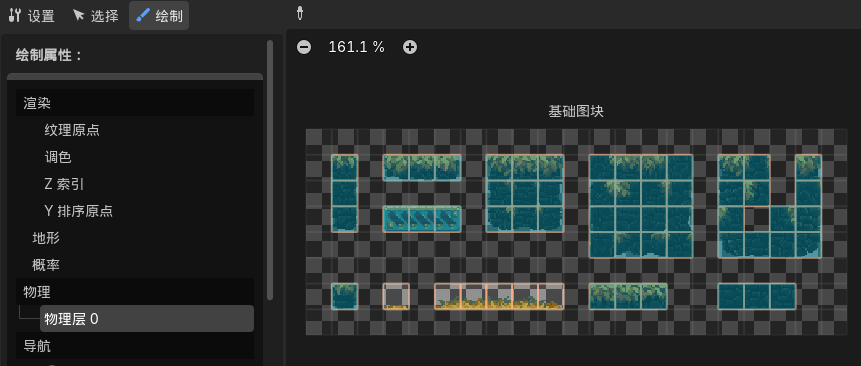

## 1. 创建tilemap节点
为2D游戏添加根节点Node2D，在根目录创建game文件夹，创建main.tscn文件
### 介绍
在 Godot 中，**TileMap** 是一个用于高效创建 2D 游戏世界的节点。它的核心思想是：使用一张包含许多小图块的**图集**（称为 **TileSet**），像铺地砖一样在网格上重复“盖”出关卡。

它的主要特点和优势如下：

-   **极高的性能**：相比于使用数百个独立的 `Sprite` 节点，TileMap 会将所有图块合并为少数的绘制指令进行渲染，能大幅降低 CPU 和 GPU 的开销。
-   **高效的编辑**：你可以像使用画图工具一样，用画笔、填充桶等工具在编辑器视图中快速绘制地形，而无需逐个创建和摆放节点。
-   **内置物理与导航**：你可以在 TileSet 中直接为每个图块定义碰撞形状、导航多边形（用于 AI 寻路）以及遮挡效果（Y-Sort）。绘制 TileMap 时，这些属性会自动生效。
-   **自动铺砌**：通过配置**地形**系统，可以让不同的图块根据相邻关系自动变化（例如草地边缘自动生成泥土过渡），这能极大地加快自然风格关卡的搭建速度。

**补充说明**：
如果你使用的是 **Godot 4**，原来的 `TileMap` 节点已被拆分为更灵活的 `TileMapLayer`。你可以使用单个 `TileMapLayer`，也可以通过堆叠多个层来实现更复杂的地图结构。

### 设置
把当前项目设置为项目主场景，**项目-项目设置-运行-主场景**res://game/main.tscn
- 按F5运行游戏，不管当前在那个场景，godot会始终运行主场景
- 开发完成后导出可执行文件，游戏会从主场景启动

Node2D节点中找到TileMap节点并创建
- 在右边tile set中选择新建瓦片集。
- 展开地形集terrain sets“添加元素-TileSet”，Mode设置为“匹配角和边”，点击上面第一个添加元素按钮，瓦片地图要与瓦片集尺寸对应
- 将瓦片资源拖入瓦片集，设置地形集为0
- 绘制。点击瓦片会启用瓦片，9x9瓦片格子，设置规则，调整瓦片概率
- 瓦片有点糊，渲染-纹理设置
- 

## 2. 创建玩家节点
- 搜索添加**角色刚体CharacterBody2D**节点来作为玩家节点，并搭配碰撞箱
- 为角色节点添加子节点，碰撞形状CollisionShape2D节点，右边选择碰撞箱形状，选择胶囊CapsuleShape形状
- 添加子节点，动画精灵AnimatedSprite2D节点，右边Sprite Frames新建精灵帧，点击展开设置，打开资源并设置vertical 和 Horizontal 来匹配动作帧，按顺序确认帧，打开循环播放
- 添加子节点，摄像机Camera2D节点。设置缩放比例，显示器长宽÷640得到缩放值，在zoom中设置x、y

## 3. 创建输入映射
项目-项目设置-输入映射，添加新动作“上/下/左/右”并建立对应输入事件

## 4. 创建玩家脚本
右键角色刚体2D节点，添加脚本Attach Script。在游戏目录中新建Script文件夹用来放置脚本文件。命名player.gd

(按住ctrl将动画精灵节点拖进常量里)

## 5. 配置地图物理层
- 项目-项目设置-层名称-2D物理，添加层名。
- 选中tilemap节点展开物理层设置Physics Layers，添加一个物理层，**碰撞层Collision Layer**是该tilemap节点所属物理层，决定其他节点能不能检测到这个物体；**碰撞掩码Collision Mask**，决定该tilemap节点能感知哪些物理层。对于地图应设置为1，0
- 为tilemap设置碰撞箱，绘制-物理-物理层0
  

>_physics_process()函数最好只做物理相关的事，不然可能浪费性能
>对于非物理函数，适合用_process()函数，每帧运行一次

## 6. 创建玩家重置区域
- 在node2D节点下新添加**Area2D节点：定义一片区域；检测所有进来的节点**
- 添加CollisionShape2D节点，并设置矩形形状，调整合适大小。
- 设置玩家碰撞层2、碰撞掩码1；重置区域碰撞层0（不需要被其他区域检测）、碰撞掩码2（检测玩家所在层）
- 添加检测脚本。右侧选节点信号标签页，body_enter信号，连接Area2D节点

注意这个脚本应该只负责探测玩家进入重置区域，并通知管理器
重置玩家位置应该放在游戏脚本里，游戏脚本应该是全局脚本而非挂在某节点上，这样一来谁都可以用。

全局脚本适合存放全局变量和控制游戏逻辑，也称**单例singleton**
godot自动加载设置，项目设置-全局-自动加载，将全局脚本放进自动加载列表，游戏一打开就会自动加载

## 7. 视察背景图层
- 创建ParallaxBackground子节点（已改用Parallax2D）
- 静态背景
  - 创建ParallaxLayer子节点并设置属性。motion中scale属性为反向运动速度，Mirroring属性为循环
  - 创建Sprite2D节点并添加资源（ctrl拖入直接创建），Transform中设置position为(0,0)，Offset中停用中心聚焦
  - 设置ParallaxLayer节点，
- 背景动画
  - 创建ParallaxLayer子节点并设置
  - 创建AnimatedSprite2D子节点，在Sprite Frames里新建精灵帧，选择在动画表中新建精灵帧，添加帧，开启加载后自动播放
- 创建粒子效果
  - 此时，为了把粒子往画面前移动，可以新建一个ParallaxBackground节点，把层属性中CarvesLayer-Layer往大了调整。
  - 添加ParallaxLayer、AnimatedSprite2D子节点并导入粒子效果动画帧
- 添加近景画布

## 8. 新增玩家特效
新建场景与Node2D根节点

## 9. 创建敌人

行走逻辑
- 让敌人检测到前方场景碰撞箱，碰到后转向。Godot常用Raycast2D节点来向前方发射射线

根节点碰撞层改为3，这样敌人就不会挡住玩家与玩家碰撞（玩家的碰撞掩码为1）

玩家动画精灵节点渲染顺序设置，z值调为100，这样玩家穿过敌人时会在敌人前方

右键点击根节点，实例化子场景，往主场景中添加敌人

## 10.创建子弹

添加根节点的Body_enter信号
创建视觉特效脚本，并传入Bullet.gd脚本

实例化子场景，看到可以发射

- 给玩家节点添加Node2D子节点Shooting_Point来记录子弹射出位置，并将该节点在玩家脚本中定义
- 将bullet.tscn加载为变量bulletToSpawn，调用GameManager里的SpawnVFX()方法来生成子弹，子弹位置就是shooting_point.global_position

## 11. 创建玩家射击系统

## 12. 创建敌人生命值系统
- Enemy.gd脚本添加类名class_name EnemyController，在
- 给敌人添加die动画

## 13. 敌人攻击
- 敌人检测玩家：
  - 增加Area2D子节点，用来检测玩家。碰撞层全关，掩码打开2
  - 增加CollisionShape2D作为攻击检测碰撞箱
  - 将Area2D节点的进入信号Body_entered连接脚本
- 伤害检测
  - 创建DamageCaster的Area2D节点，设置Monitoring属性来控制能不能检测到玩家
  - 可以打开 调试-显示碰撞区域
  - 可以把playerdetector和damagecaster两节点重设父节点，用一个Node2D节点来管理朝向（重设脚本中相关路径）

## 14. 玩家生命值系统
- 枚举enumeration玩家状态，用enum关键字，这样方便维护和扩展。
- 在当前变量脚本里添加玩家状态设置器，只要状态改变可以直接调用设置器，播放相应动画。正常状态还是由更新函数来处理

