考试题型：大题 客观题 主观题
可能考点：7个上机题目，课件例题（类似举一反三），设备管理（重点中断处理几种方式和几种缓冲），死锁、抖动怎么产生
课件例题：信号量（PV原语）、生产者消费者问题、读者写者问题、哲学家进餐问题、怎样引发死锁（进程执行顺序、生产者消费者问题调换原语位置）、银行家算法、存储管理中的计算、请求分页中的抖动、磁盘调度

学习目的：一星期通过期末考试，加油吧孩子

# 一、操作系统概述
## 操作系统定义
控制和管理整个计算机系统的硬件和软件资源，并合理地组织和调度计算机地工作和资源地分配，以提供给用户和其他软件方便地接口和环境，是计算机系统中最基本地系统软件

- 是系统资源（软件和硬件）的管理者
- 向上层提供方便易用的服务（封装思想：将底层功能封装成简单的服务）
- 最接近硬件的软件，实现对硬件的拓展

补充：没有软件支持的计算机称为**裸机**，覆盖了软件的机器称为**扩充机器/虚拟机**
## 操作系统的分类
### 批处理阶段————单道批处理系统
前一个程序的输入-计算-输出整个过程结束后，才会执行下一个程序
### 多道批处理系统(Batch Processing System),
解决CPU利用率低的问题，实现程序并发。然而不能够人机交互

**特点：**
- 多道性，内存中同时存放多道相互独立的程序。 
- 宏观上多道程序并行，微观上交替执行。  
- 共享软、硬件资源 ，使计算机四类资源（CPU、内存、外设、信息文件），尤其是CPU得到充分利用。
### 分时系统
“分时”是指多个用户对系统资源进行时间上的分享。是通过分配“时间片”(Time Slice)来实现的。

计算机以时间片为单位轮流为各个用户/作业服务，解决了人机交互的问题。但不能优先解决紧急任务

**特点：**
- 多路性  一台主机同时连接多台终端，系统支持多个终端用户同时工作，按照分时原则为用户服务。
- 独立性  各用户终端相互独立工作，互不干扰。
- 及时性  **用户请求能得到及时响应。**

### 实时系统
“实时”—立即、及时，指系统能够及时响应随机发生的外部事件，并优先以足够快的速度完成对时间事件的处理。

- 硬实时系统：必须在严格时间内完成处理（导弹控制系统、自动驾驶系统）
- 软实时系统：能够接受偶尔违反时间规定（火车票更新）
**特点：**
- 及时性，对响应时间有较高要求。
- 多路性。对多路现场信息进行采集,对多个对象或执行机制进行控制。
- 独立性，对信息的采集及对对象的控制相互独立，互不干扰。

### 其他如网络操作系统、分布式操作系统等

## 操作系统功能
计算机四大类资源：
cpu————处理机管理/进程管理
内存————存储器管理
外设————设备管理
信息文件————文件管理
### 处理机管理
对处理机进行分配和资源回收，多道程序系统中，处理机的分配和运行都是以进程为单位的，故处理机管理又归结为进程管理。
**进程控制**进程的创建、撤消、状态转换等控制。
**进程同步**协调、控制系统中进程的并发执行。（互斥、同步）
**进程通信**进程之间交换信息 — 高级通信方式。
**进程调度**按照某种调度策略，实现对CPU的分配。
### 存储器管理
主要涉及内存管理，任务是为多道程序的执行提供必要、良好的环境。为用户提供足够大的存储空间。
主要任务：内存分配与回收、存储保护、地址映射、内存扩充

补充：执行一个程序前**需要把该程序放进内存**
### 设备管理
基本任务是为用户提供统一的与设备无关的接口。对各种外设进行调度、分配、实现设备的中断处理及错误处理等。

缓冲技术、虚拟设备
### 文件管理
即对计算机软件资源的管理。基本任务是：
  1. 负责文件的物理存储空间的组织分配与回收。
  2. 实现文件的按名存取。
  3. 实现文件与目录的创建、读、写、及修改、删除等基本操作。
  4. 文件的保护与保密。


### 用户接口
**1.命令接口** （ 联机、脱机）联机命令接口=交互式命令接口；脱机命令接口=批处理命令接口
**2.程序接口** （**系统调用**）是为用户程序在执行过程中访问系统资源而设置的一组**广义指令**，以函数的形式提供。（程序员借助库函数使用程序接口）。**广义指令=系统调用**

补充：应用程序通过系统调用请求操作系统的服务。系统中的各种共享资源都由操作系统内核统一管理，因此**凡是与共享资源有关的操作（如存储分配、IO操作、文件管理）**，都必须**通过系统调用向**操作系统内核提出服务请求，由操作系统内核代为完成，以**保证系统的稳定性和安全性**，防止用户进行非法操作。
**3.图形接口**   是一种全新的人机界面，提供图形化用户界面/接口 （GUI）和符号操作。


## 操作系统特征
并发和共享是两个最基本的特征，二者互为存在条件。

如果失去并发性，系统中只有一个程序正在运行，则共享性失去存在意义；如果失去共享性，并发程序不能同时访问硬件资源，则无法实现并发
### 并发性(Concurrence)
并发性是指两个或多个事件在同一时间间隔内发生，宏观上有多道“程序”同时运行。（微观上交替进行）

操作系统就是伴随着多道程序技术而出现的，可以说操作系统和程序并发是一起诞生的。并发性有效地改善了系统资源的利用率，提高系统的吞吐量。当然，也使操作系统的实现变得复杂。

补充：**并行**指两个或多个事件在同一时刻同时发生。**单核CPU**同一时刻只能执行**一个程序**，各程序只能并发地执行；**多核CPU**同一时刻可以同时执行**多个程序**，多个程序可以并行地执行
### 共享性(Sharing)
内存中多个并发执行的进程共同使用有限的资源。
**同时**访问：在宏观上，允许多个进程“同时” （即分时共享）访问某个资源。或者微观上真的在同时使用
**互斥**访问：一段时间内只允许一个进程访问该资源。只有该进程释放资源后，其他进程才能访问。该资源称为**临界资源**。

### 虚拟性(Virtual)
通过某种技术把一个物理设备变成逻辑上的多个。
分时系统中，将一个物理CPU虚拟为多个。

- 空分复用技术（如虚拟存储器技术）
- 时分复用技术（如虚拟处理机）

没有并发性就谈不上虚拟性

虚拟存储管理，将一个统一编址的物理存储器变为多个逻辑上独立编址的存储器等。

### 异步性(Asynchronism)
即不确定性，不按照顺序进行。在多道程序环境下，各进程交错执行，“走走停停”，各进程的执行时间和执行顺序是不确定的。      
即进程是以异步方式执行的。


## 操作系统运行机制
### 两种程序：内核程序/应用程序
应用程序是跑在操作系统之上的。开发操作系统的程序就是内核程序，许多内核程序组成“操作系统内核”，或“内核（kernel）”。是操作系统最核心最接近硬件的部分，操作系统的功能未必都在内核中（如GUI）。

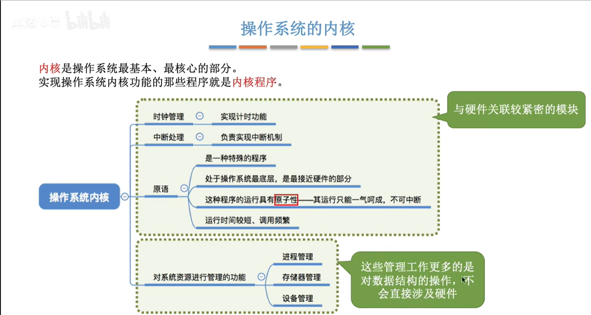、
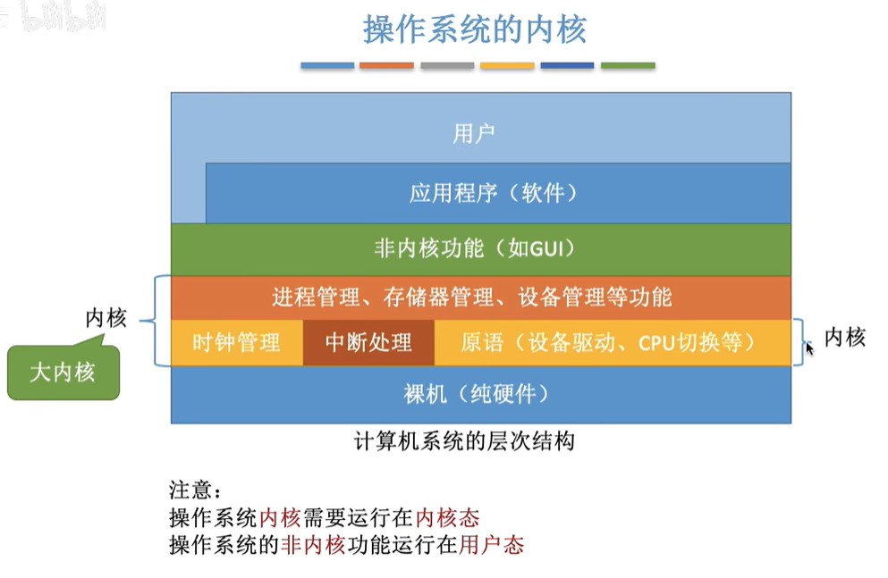
### 两种指令：特权指令/非特权指令
指令：处理器（CPU）能识别、执行的最基本的命令。

操作系统内核作为“管理者”，可以让CPU执行一些**特权指令**如内存清零指令。特权指令只允许操作系统内核来使用。

应用程序只能使用**非特权指令**。

注：上述指令为二进制机器指令。区分其与交互式命令接口。
### 两种处理机状态：用户态/核心态
cpu能够分辨特权指令与非特权指令，但要区分正在运行的是应用程序还是内核程序。

程序状态寄存器（PSW）将CPU分为内核态（1）和用户态（0）。通过**特权指令修改PSW**将cpu从内核态转为用户态；由中断引发用户态到内核态的转变，中断后**硬件自动完成变态**过程。

内核态=核心态=**管态**；用户态=**目态**

### 中断与异常
在合适的情况下，操作系统内核会把CPU使用权交给应用程序。中断时让**操作系统内核夺回CPU使用权**的唯一途径。

不同的中断信号需要查询中断向量表，使用不同的中断处理程序处理。显然中断处理程序为内核程序，需要运行在内核态
#### **内中断**：
也称**异常**（陷入trap、故障fault、终止abort）

与当前执行指令有关，中断信号来源于CPU内部。

例如在应用程序中执行特权指令；缺页故障；指令参数违法（除以零）；应用程序请求操作系统内核服务，会执行**陷入指令**，引发一个内部中断信号

**陷入指令是在用户态执行的**，执行陷入指令后引发内中断，使CPU进入核心态。
#### **外中断：**
与当前执行的指令无关，中断信号来源于CPU外部。

例如**时钟中断**、I/O中断（输入输出完成后发出的中断信号）、


## 操作系统的体系
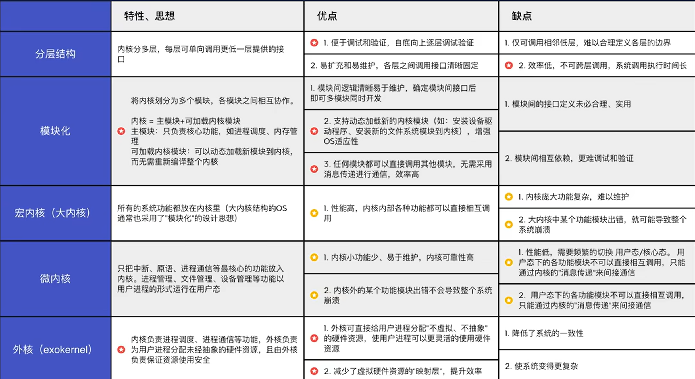
### 模块组合结构
### 层次结构
上层只可单向调用更低一层的接口，方便调试验证
### 大内核结构
进程管理、存储管理、设备管理 与 时钟管理、中断处理、原语都属于内核态
### 微内核结构
时钟管理、中断处理、原语属于内核态，进程管理、存储管理、设备管理属于用户态，导致CPU状态的转换变多，性能低但内核功能少，结构清晰，方便维护。
### 客户——服务器体系结构


## 操作系统的引导
### 什么是操作系统的引导（boot）
在开机的时候如何让操作系统在电脑上运行起来
### 磁盘里有哪些相关数据
主引导记录(MBR)：包含磁盘引导程序和分区表(DS，说明占用空间大小和地址范围)
- C盘，安装了操作系统的，称为该磁盘的**活动分区**
  - 引导记录PBR，负责找到启动管理器
  - 根目录，包含一些文件夹和文件
  - 其他

补充：计算机主存包含RAM和ROM。RAM俗称运行内存，断电则数据丢失 。ROM存储BIOS(Basic Input/Output System，基本输入输出系统)，最主要的是ROM引导程序/ROM boot程序。

### 操作系统引导的过程
1. CPU从一个特定的主存地址开始取指令，执行ROM中的引导程序
2. 将磁盘的第一块————主引导记录 读入内存，执行磁盘引导程序，扫描分区表
3. 从活动分区读入分区引导记录，执行其中的程序
4. 从根目录找到完整的操作系统初始化程序（启动管理器）并执行，完成开机

## 虚拟机VMM
也称虚拟机管理程序/虚拟机监控程序/Virtual Machine Monitor/Hyperviser
使用虚拟化技术，将一台物理机器虚拟化为多台虚拟机器（Virtual Machine，VM），每个虚拟机器可以独立运行一个操作系统

分为两类：
- 直接运行在硬件上，由虚拟机管理程序，将物理硬件分为多个部分分给多台虚拟机器，并可以安装不同操作系统（windows、linux）。只有虚拟机管理程序运行在内核态，虚拟机器中的操作系统在用户态/虚拟内核空间，会使用一些特权指令经过虚拟机管理程序转换运行。
- 运行在宿主操作系统(host OS)上，再安装并启动别的操作系统

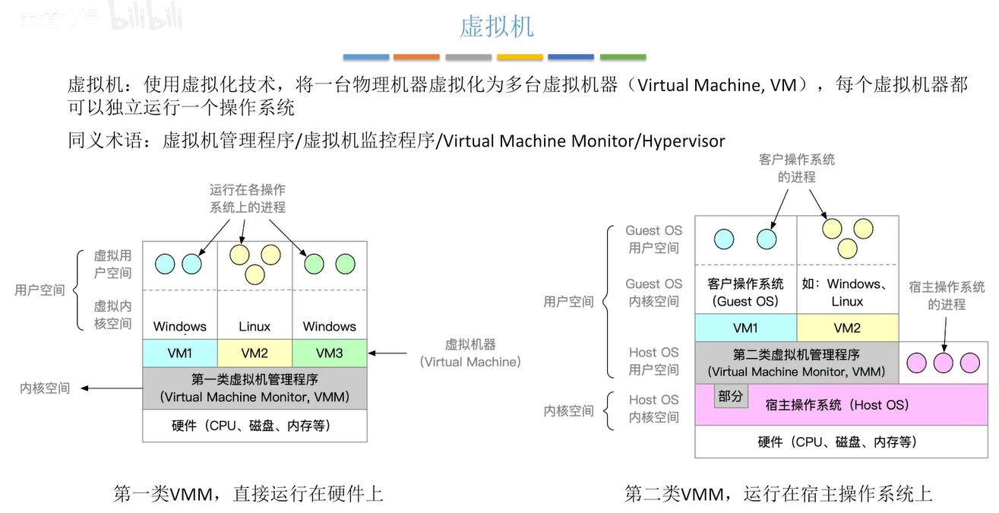
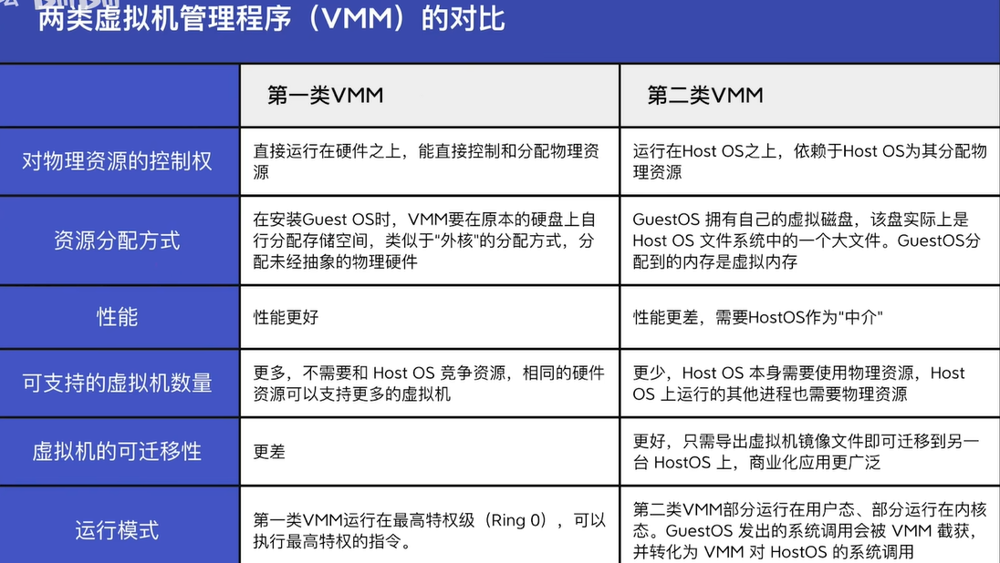


# 二、进程管理
## 程序与进程
进程的引入是为了更好地描述程序并发执行的动态特征。
### 程序
#### 程序顺序执行
1. 顺序性: 处理机操作严格按照程序所规定的顺序执行。
2. 封闭性：程序独占资源，除初始状态外，只有程序本身规定的操作才能够改变资源状况，即程序在封闭环境下运行。
3. 可再现性: 程序的运行结果与它执行的速度无关。
#### 前趋图
- 有向无环图
- 节点表示：语句、程序段、进程
- 箭头表示：前面节点必须在后续节点之前完成
#### 程序的并发执行
是指在逻辑上相互独立的一组程序在执行时间上的相互重叠，即一个程序段的执行尚未结束，另一程序段的执行已经开始。
1. 并发执行的程序间共享资源相互约束，通信协作相互依赖
2. 对系统资源争夺与共享（无封闭性）
3. 程序走走停停，资源动态分配，（间断性、不可再现性）
    - 由于失去了封闭性，多次重复执行可得到不同的结果。
### 进程
#### 进程的定义
进程是可并发执行的程序在给定数据集合上的一次执行**过程**，是系统进行**资源分配和调度**的一个独立的基本单位和实体，是执行一个映象程序的总环境，是一个动态的概念

进程是进程实体的运行过程，是系统进行资源分配和调度的一个独立单位。
#### 进程的特征
- 动态性：最基本的特征，对应程序的执行，动态产生、动态消亡
- 并发性：重要特性，任何进程都可以同其他进程一起向前推进
- 独立性：地址空间相互独立（除非进程间通信）
- 异步性：每个进程都以其相对独立的不可预知的速度向前推进
- 结构化：进程 = PCB + 代码段 + 数据段
### 程序与进程的区分
进程是执行程序的动态过程—动态概念; 程序是进程运行的静态文本—静态概念。
一个进程可以执行一个或多个程序; 一个程序可以被多个进程执行。
程序可以作为一种资源以文件的形式长期保存; 进程只是一次执行过程，具有生命期。


## 进程的描述
### 进程组成。
由程序，相应的数据集合，进程控制块三部分组成进程实体（进程映像）
- 静态描述：
  - 程序段 — 静态文本/指令序列，描述进程所要完成的功能。
  - 数据段 — 程序运行时所需的数据和工作区。
- 动态描述：
  - 进程控制块PCB（Process Control Block） — 记录和描述进程的动态特性，描述进程的执行情况和状态变化。

#### 进程控制块PCB（Process Control Block）
记录和描述进程的动态特性，描述进程的执行情况和状态变化。

**PCB 块是一个进程存在的唯一标志** ，当系统创建一个进程时，为该进程设置一个 PCB，再利用PCB对进程进行控制和管理。当进程撤消时，系统回收它的PCB。

包含信息：
1. 进程标识信息
  进程标识信息PID、用户标识信息UID、进程家族标识
2. 处理机状态信息
通用寄存器、指令计数器、程序状态字（PSW）用户栈指针
3. 进程调度信息
 进程状态、进程优先级、其他调度信息、等待事件
4. 进程控制信息 
 程序数据地址、进程同步及通信、资源清单、链接指针


### 进程基本状态与状态转换
基本状态：执行、就绪、阻塞
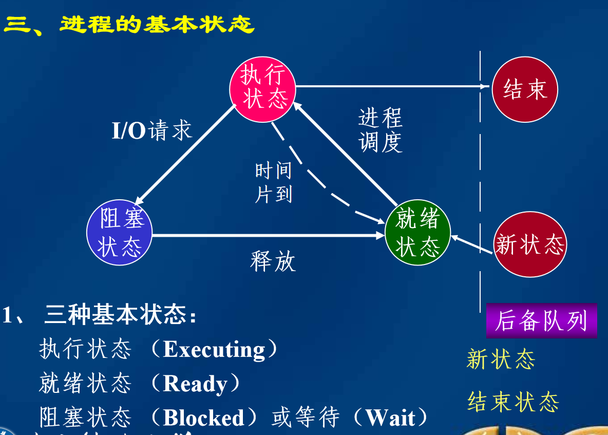
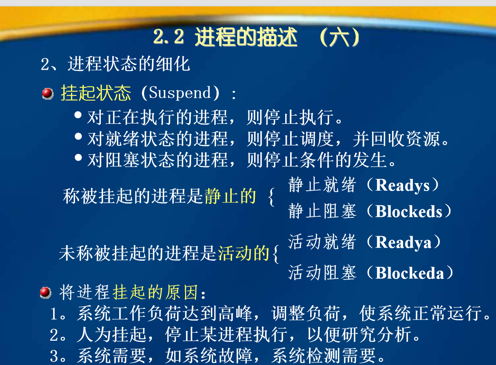
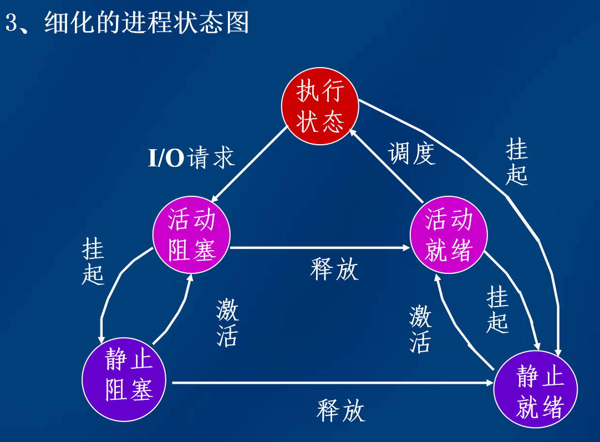
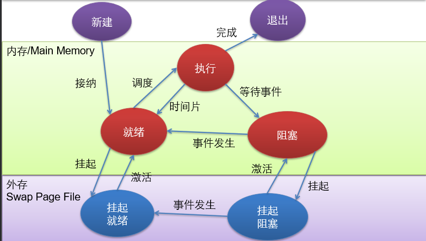

### 进程运行状态
操作系统中，为了防止用户进程对OS及PCB等关键信息的破坏。  一个进程在其生命期中有两种机器运行状态：
- 系统态 （核心态,管态）具有较高的访问权，可访问核心模块。  
- 用户态 （目态 ） 限制访问权
- 
### 进程的组织
#### 链接方式：队列
执行指针————指向当前处于运行态的进程
就绪队列指针————指向当前处于就绪态的进程，通常把优先级高的进程放在队头
阻塞队列指针————指向当前处于阻塞态的进程
#### 索引方法：索引表
执行指针
就绪表指针
阻塞表指针


## 进程控制
进程控制主要功能是对系统中所有进程实施有效的管理，具有创建新进程、撤销已有进程、实现进程状态转换等功能。
### 原语
执行具有原子性，一旦开始执行就必须完成，不可被中断。
属于内核程序。**通过开中断和关中断两个特权指令来实现原子性**：执行关中断程序之后就不在例行检查中断信号，直到执行开中断指令之后才会恢复检查

- **创建原语  create（）**
  申请空闲PCB，为新进程分配所需资源并将该进程置为就绪状态，初始化PCB，将PCB插入就绪队列。创建态->就绪态
- **撤消原语  destroy（）**
  从PCB集合中找到终止进程的PCB，若进程正在运行则立刻剥夺cpu并终止其所有子进程，将该进程拥有的所有资源归还给父进程或操作系统，删除PCB。
  当进程正常完成、外界干预或产生异常中断时，应立即撤消并释放其所有资源。
- **阻塞原语   block（）**
  找到要阻塞的进程的PCB，**保护进程运行现场**，将PCB状态设置为阻塞态，暂停进程运行，将PCB插入相应事件的等待序列。

  把进程从执行状态转换为阻塞状态。需要等待系统分配相关资源，或者需要等待相互合作的其他进程完成工作。
- **唤醒原语   wakeup（）**
  在等待队列中找到PCB，将PCB从等待序列中移除，设置进程为就绪态，将PCB插入就绪队列，等待被调度。
  将进程从等待状态转换为就绪状态
- **挂起原语  suspend（）**
  将进程的环境信息存入PCB，PCB移出相应队列
  将进程从活动状态转换为静止状态。
- **激活原语   active（）**
  将进程从静止状态转换为活动状态。


补充：CPU中有很多寄存器，如PSW程序状态寄存器，PC程序计数器（存放下一条指令的地址），IR指令寄存器（存放当前正在执行的指令），通用寄存器等。保存运行环境即保存一些必要的寄存器信息


## 进程间通信Inter-Process Communication，IPC）
指两个进程之间产生数据交互
需要操作系统支持（原因在于各进程拥有的**内存地址空间相互独立**，为了安全，一个进程不能直接访问另一个进程的地址空间）

### 通信方式
#### 共享存储
进程申请共享存储区，在共享存储区中的数据可以被多个进程所共享。通过增加页表项/段表项即可将一片共享内存空间映射到各个进程的虚拟地址空间中。各个进程对共享空间的访问应该是**互斥**的（通过P、V操作实现）。
- 基于存储区的共享：速度快，是高级通信方式
- 基于数据结构的共享：速度慢，限制多，低级通信
#### 消息传递
进程间数据交换以格式化的消息（消息头和消息体）为单位。进程通过操作系统的发送消息/接受消息原语进行数据交换
- 直接通信方式：发送进程要指明接收进程的ID
- 间接通信方式：通过“信箱”通信
#### 管道通信
特殊共享文件pipe，在内存中开辟一个大小固定的缓冲区。存储信息循环队列单向先进先出，只能采用**半双工通信**。要实现**双向同时通信，则需要设置两个管道**（相较而言，共享存储区中读取数据没有限制）。进程互斥的访问管道

然而管道数据一旦被读出就彻底消失。多个进程读同一个管道时可能会错乱。
解决方案：1.**一个管道允许多个写进程，一个读进程**；2.多个写进程，多个读进程，但读进程轮流从管道中读数据（Linux）。


## 进程同步与互斥
进程具有**异步性**，即各并发执行的进程以各自独立的、不可预知的速度向前推进
### 并发进程的约束关系
并发执行的进程之间，通常有两种关系：
**1.互斥关系**  进程之间彼此无关，但是由于竞争使用同一共享资源而产生了相互约束的关系。这种因共享资源而产生的制约关系称为**进程的互斥。也称间接相互制约关系**

**2.同步关系**  多个并发执行的进程，在共同协作完成一项任务的过程中，相互约束，如一个进程在没有获得合作进程提供的必要信息之前，不能超越某个执行点。进程之间通过在执行时序上的某种限制而达到相互合作的这种约束关系称为**进程的同步 — 直接相互制约关系**

### 临界资源
#### 临界资源
凡是**以互斥方式使用的共享资源都称为临界资源**。临界资源具有一个时间段内只允许一个进程使用的属性。互斥共享方式

补充：同时共享方式，系统中某些资源允许 一个时间段内多个进程“同时”对他们进行访问
#### 临界区（critical  section）
每个进程互斥访问临界资源的那段代码称为临界区。

补充：对临界资源的互斥访问，可以在逻辑上分为以下四个部分
```c
do{
  entry section; //进入区
  critical section; //临界区
  exit section; //退出区
  remainder section; //剩余区
}while(true)
```
进入区负责检查可否进入临界区，如果可以进入，则应设置**正在访问临界资源**的标志，以阻止其他进程同时进入临界区。
退出区负责解除**正在访问临界资源**的标志
进入区和退出区是负责实现互斥的代码段
临界区是进程中访问临界资源的代码段，也称临界段。

### 互斥访问的原则/同步机制
**空闲让进**   无进程处于临界区内时，可让一个申请进入该临界区的进程进入。
**忙则等待**   临界区内有进程时，申请进入临界区的进程必须等待。
**有限等待**   进程进入临界区的请求，必须在有限的时间内满足。（保证不会饥饿）
**让权等待**   等待进入临界区的进程，必须立即释放CPU，防止进程忙等待。

### 进程互斥的软件实现方法
#### 单标志法
两个进程在访问完临界区后会把使用临界区的权限交给另一个进程，每个进程使用临界区的权限只能被另一个进程赋予。

```c
int turn = 0; //turn表示当前允许进入临界区的进程号
//p0进程：
do{
  while(turn != 0); //若进入区进程号不符合，重复执行循环，进程卡在进入区
  critical section; //临界区
  turn = 1; //退出区
  remainder section; //剩余区
}
//p1进程：
do{
  while(turn != 1); //进入区
  critical section; //临界区
  turn = 0; //退出区
  remainder section; //剩余区
}
```
问题：进程轮流访问，可能临界区空闲但进程无法使用，**违背“空闲让进”原则**

#### 双标志先检查
设置bool型数组flag[]，数组中各元素用来标志各进程想进入临界区的意愿。每个进程在进入临界区前先检查有没有别的进程想进入临界区，如果没有，将自己的标志设为true并开始访问临界区
```c
bool flag[2];
flag[0]= false;
flag[1] = false;
//p0进程：
do{
  while(flag[1]); //若有别的进程想进入临界区，重复执行循环
  flag[0] = true;
  critical section; //临界区
  flag[0] = false; //退出区
  remainder section; //剩余区
}
//p1进程：
do{
  while(flag[0]); //若有别的进程想进入临界区，重复执行循环
  flag[1] = true;
  critical section; //临界区
  flag[1] = false; //退出区
  remainder section; //剩余区
}
```
问题；进程可能同时访问临界区（都执行完第一条语句但还没执行第二条语句），**违反“忙则等待”原则**。原因是进入区检查和上锁两个动作不连续。
#### 双标志后检查
修正先检查法，先上锁后检查。
```c
bool flag[2];
flag[0]= false;
flag[1] = false;
//p0进程：
do{
  flag[0] = true;
  while(flag[1]); //若有别的进程想进入临界区，重复执行循环
  critical section; //临界区
  flag[0] = false; //退出区
  remainder section; //剩余区
}
//p1进程：
do{
  flag[1] = true;
  while(flag[0]); //若有别的进程想进入临界区，重复执行循环
  critical section; //临界区
  flag[1] = false; //退出区
  remainder section; //剩余区
}
```
问题：可能同时上锁导致进程都不能使用临界区，**违背“空闲让进”和“有限等待”原则**，各进程可能因为长期无法访问临界资源而**产生“饥饿**”现象

#### Peterson算法
结合双标志法、单标志法的思想
```c
bool flag[2]; //表示进入临界区的意愿的数组，初始值为false
int turn = 0; //turn表示优先让哪个进程进入临界区
flag[0]= false;
flag[1] = false;
//p0进程：
do{
  flag[0] = true;
  turn = 1;
  while(flag[1] && turn == 1);
  critical section;
  flag[0] = false;
  remainder section;
}
//p1进程：
do{
  flag[1] = true; //表示自己想进入临界区
  turn = 0; //可以优先让对方进入临界区
  while(flag[0] && turn == 0); //对方想进，且最后一次是自己谦让，那就循环等待
  critical section; //临界区
  flag[1] = false; //退出区，访问完临界区，表示自己不想访问临界区了
  remainder section; //剩余区
}
```
通过软件解决进程互斥问题，**遵循了空闲让进、忙则等待、有限等待的原则**，但依然**没有遵循让权等待原则**，一直检查while循环是否被满足，一直在cpu上运行，占用cpu。

### 进程互斥的硬件实现方法
#### 中断屏蔽方法
与原语实现思想相同，利用“开/关中断指令”实现，即在某进程开始访问临界区到结束访问为止都不允许被中断，也就不能发生进程切换，也就不会发生两个同时访问临界区的情况。
>关中断
>临界区
>开中断

简单高效，
缺点：不适用于多处理机，只适用于操作系统内核进程，不适用于用户进程（开关中断指令只能运行在内核态）
#### TestAndSet/TestAndSetLock(TS指令/TSL指令)
实现简单，适用于多处理机
不满足让权等待，导致忙等

#### Swap指令(XCHG指令)
逻辑上同TSL
实现简单，适用于多处理机
不满足让权等待，导致忙等


## 线程
传统进程只能串行地执行一系列程序，是执行流地最小单位
引入线程之后，同一个进程被分开成不同线程，**线程成为了程序执行流最小单位，是基本的CPU执行单元/调度的基本单位**

并发性上，传统进程机制只能进程间并发。引入线程后，各线程也能并发，提高了并发度。

系统开销上，**传统的进程并发，需要切换进程的运行环境**，系统开销大。线程间并发时，同一进程内的线程切换不需要切换进程环境，开销减少。


### 线程的实现方式
1. 用户级线程（User-level Thread，ULT），通过线程库实现，即应用程序通过线程库来管理线程，并不由操作系统完成，不需要cpu从用户态切换到内核态。
缺点是当一个用户级线程被阻塞后，整个进程都被阻塞，并发度不高。CPU调度最小单位仍为进程，多个线程不可在多核处理机上并发运行
2. 内核级线程（Kernel-Level Thread，KLT）
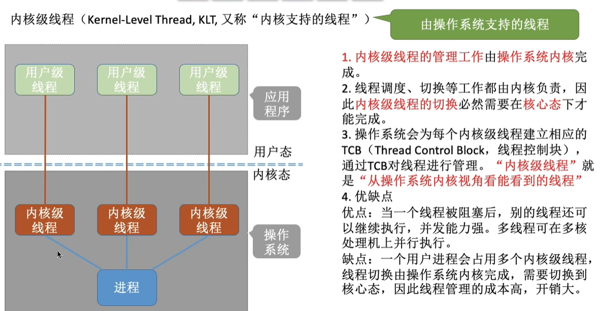
3. 多线程模型
   - 一对一模型：一个用户级线程映射到一个内核级线程
   - 多对一模型：多个用户级线程映射到一个内核级线程（退化为用户级线程）
   - 多对多模型：n个用户级线程映射到m个内核级线程(n>=m)。既克服多对一模型并发度不高的缺点（一个阻塞全部阻塞），又克服了一对一模型中一个用户进程占用太多内核级线程，开销太大的缺点。

### 线程的状态和转换
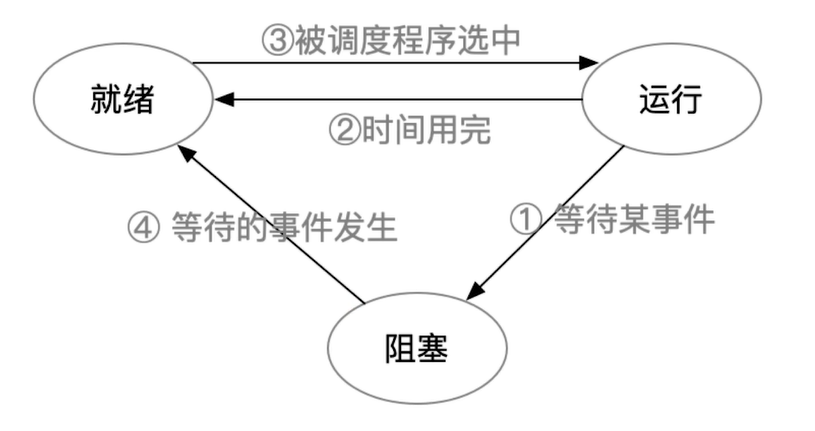
### 线程的组织和控制
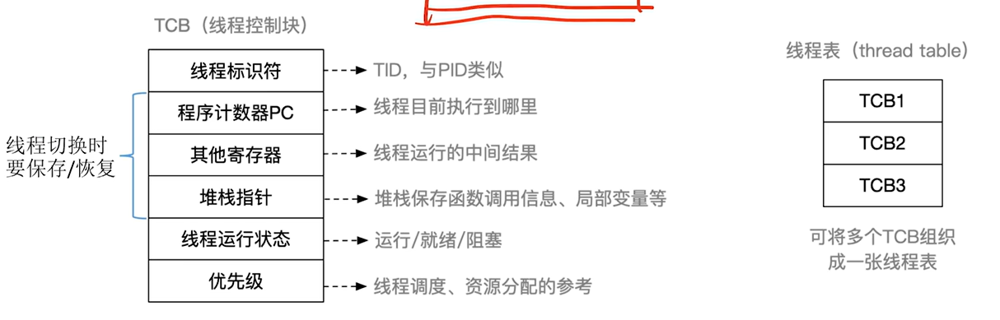


## 信号量（semaphore）
资源抽象为信号量（Semaphore）， 引入在信号量基础上的同步操作原语： P操作、V操作。

#### P、V原语
1. **P操作（wait 原语）**
每作一次P操作，申请分配一个单位的资源。
P（S）— 对信号量S 进行P操作。
① S.value ：= S.Value - 1；
②若 S.Value ≥ 0 进程继续执行。
若 S.Value < 0 进程阻塞，并进入等待队列。


2. **V操作（Signal原语）**
V（S）— 对信号量S 进行V操作，释放一个单位的资源。
①S.value ：= S.Value + 1；
②若 S.Value > 0 进程继续执行。
若 S.Value ≤ 0 则释放S等待队列中的一个进程，使之转为就绪状态。

**说明：**
 ① S.Value  > 0 时，其值表示某类资源可用数量。
  S.Value ≤ 0 时，其绝对值表示在信号量队列中等待该资源的进程数。
 ② P、V操作有严格的不可分割性；执行过程不允许中断；
 ③ P、V操作成对出现。

### 信号量的应用
#### 实现进程互斥
mutex —公共互斥信号量
初值：mutex.Value = 1 > 0
进程P1先执行P（mutex）；mutex.Value = 0进程P1进入临界区；
进程P2开始执行P（mutex）；mutex.Value = -1,进程P2阻塞，插入阻塞队列。
若进程P1再次执行V（mutex）；mutex.Value = 0,释放资源。进入P2临界区
。。。
执行过程中mutex.Value 的值，在 1，0，-1 之间变化。
为了实现进程互斥地进入临界区，只须把临界区CS置于P (mutex)和V (mutex)之间。

#### 实现进程同步
设置资源信号量，初值为0

#### “AND 信号量集”机制
一个进程需要获得多个资源，才可能运行。效率低。
多个进程同时需要获得相同的多个资源，容易产生“死锁”

引入“AND 信号量集” —— 一个进程必须同时分配其所需要的资源，或者同时释放所有资源。在分配资源的过程中，只要有一个资源无法获得，则必须释放已占有的其它资源。

## 进程同步问题
需要同步信号量和互斥信号量，先执行同步信号量的wait操作再执行互斥信号量的wait操作。**“先互斥再同步”**
被多个进程访问的临界资源都应设置一个互斥信号量
### 生产者消费者问题
- 生产者：满则等待，空则填充
- 消费者：空则等待，有则获取
- 不允许同时进入缓冲区
- 资源信号量P、V操作分布在不同进程
- 互斥信号量P、V操作出现在同一进程
### 读者写者问题
- 三个角色
  - 一个共享的数据区；
  - Reader: 只读取这个数据区的进程；
  - Writer: 只往数据区中写数据的进程；
- 三个条件
  - 多个Reader可同时读数据区；
  - 一次只有一个Writer可以往数据区写；
  - 数据区不允许同时读写。
- 额外条件：
  - 读者优先：如有读者正在读数据，则允许多个读者同时进入读数据；只有当全部读者退出，才允许写者进入写数据。（读者插队）
  - 写者优先：如果写者正在写，那么后续的写者优先于前面等待的读者进入；写者都退出后，读者进入。（写者插队）
  - 先来后到
### 哲学家进餐问题
描述：
- 5个哲学家围坐一张餐桌
- 5只餐叉（筷子）间隔摆放
- 思考或进餐
- 进餐时必须同时拿到两边的餐叉
- 思考时将餐叉放回原处


## 管程
是一种**高级的同步机制**。将分散的各同类临界区集中起来，为每一类共享资源设置一个“管理程序 ”，统一控制和管理各进程对该资源的访问，即任何一个进程要访问共享资源，必须通过管程。
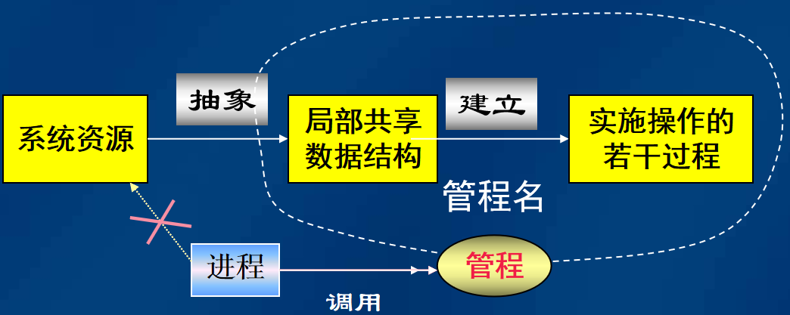
### 为何引入管程/存在问题：
信号量机制存在问题：编写程序困难、易出错
1、 临界区的执行分散在各个进程中，不便于系统对临界资源的控制和管理。
2、难于发现和纠正用户程序中对同步原语使用的错误。
### 管程的组成
- 管程名
- 局部于管程的**共享数据结构** （共享变量说明）
- 对数据结构实施操作的**若干过程**（“过程”可认为是函数）
- 对局部于管程的共享数据设置初始值的语句。（置初值语句）

类似于面向对象语言中的“类”
### 实现管程的基本原则 
- 管程中的局部变量只能由该管程的过程来访问，不允许进程直接访问，也不允许其他管程访问。
- 任何一个进程要访问共享资源必须通过管程，即调用管城内的过程，才能进入管程访问共享资源（管程入口）。
- 管程**每次只允许一个进程进入**执行某个管程内部过程。（类比缓冲区的访问）
- 管程的过程执行时，因某种原因阻塞，应立即退出并释放资源。

补充：
各进程必须互斥访问管程的这种互斥特性是由编译器负责实现的，程序员不用关心。
可在管程中设置条件变量及等待/唤醒操作以解决同步问题


# 三、调度与死锁
## 调度
无法同时处理所有任务，

### 调度的类型
**1、高级调度**又称为**作业调度**，它决定将哪些在外存上处于后备状态的作业调入主机内存，准备执行。因此，有时把它称为**接纳调度**。作业即指一个具体任务，**每个作业只调入一次，调出一次**。作业调入时会建立PCB
**3、中级调度**又称为**内存调度**，的主要作用是在内存和外存之间进行进程交换，以解决内存紧张的问题。如它将内存中处于等待状态的某些进程调至外存对换区，以腾出内存空间，而将外存对换区上已具备运行条件的进程重新调入内存，准备运行。有时把它称为**交换调度**。
**2、低级调度**又称为**进程调度/处理机调度**，是操作系统最基本的调度它决定就绪队列中哪个进程将获得处理机，并实际执行将处理机分配给进程的操作。执行分配处理机的程序称为分派程序。

### 进程调度的时机
**需要进行**进程调度与切换的情况：
- 当前运行的进程主动放弃处理机
  - 进程正常终止
  - 运行发生异常而终止
  - 进程主动请求阻塞（如等待IO
- 当前进程被迫放弃进程
  - 分配给进程的时间片用完
  - 有更紧集的事要处理（如IO中断
  - 有更高优先级的进程进入就绪队列

**不能进行**进程调度的情况：
- 处理中断过程中。
- 进程在操作系统**内核程序临界区**中。（内核程序临界区一般用来访问某种**内核数据结构**，如由就绪进程的PCB组成的进程就绪队列。访问普通临界区时可以进程调度和切换）
- 在原子操作过程（原语）中。


#### 调度时机————什么事件会触发调动进程/调度器
- 创建新进程
- 进程退出
- 运行进程阻塞
- 发生IO中断 

#### 调度对象
不支持内核级线程的操作系统，调度程序的处理对象是进程
支持内核级线程的操作系统，调度程序的处理对象是内核线程


### 进程调度的方式
**非抢占式（非剥夺式）**：进程一旦被调度，就一直占有CPU，直到完成或因发生某事件而被阻塞（I/O请求）。

采用非抢占式调度策略，只有运行进程阻塞或退出才会触发调度程序工作。即当前进程主动唤醒调度程序让他检查

**抢占式（剥夺式）**：进程未执行完，可由调度程序剥夺其CPU，另分配给别的进程。抢占的原因有：优先级、时间片、短进程等。

抢占式调度策略，时钟中断也会触发调度程序工作。每隔一段时间就要唤醒调度程序检查就绪队列。

### 进程调度的功能
记录系统中所有进程的执行情况
确定分配处理机的原则（调度算法）
分配处理机给进程
回收处理机、进行进程上下文切换（切换是指进程让出处理机，另一个进程占用处理机的过程）

### 闲逛进程idle
没有其他就绪进程时，运行闲逛进程。cpu不闲置
#### 闲逛进程特性
- 优先级最低
- 能耗低
- 可以是0地址指令，占一个完整的指令周期（指令周期末尾例行检查中断）


## 调度算法
### 调度算法评价
$cpu利用率= \frac{忙碌的时间}{总时间}$（cpu造价昂贵）

$系统吞吐量 = \frac{总共完成多少道作业}{总共花了多少时间}$

$周转时间 = 作业完成时间 - 作业提交时间$
（包含等待作业在外存后备队列等待作业调度时间、进程在就绪队列上等待进程调度时间、进程在cpu上执行时间、进程等待IO完成时间）

$平均周转时间 = \frac{各作业周转时间之和}{作业数}$

$带权周转时间 = \frac{作业周转时间}{作业实际运行时间} = \frac{作业完成时间-作业提交时间}{作业实际运行时间}$

$平均带权周转时间 = \frac{各作业带权周转时间之和}{作业数}$

响应时间是用户提交请求开始到首次被响应的时间


### 先来先服务（FCFS）算法
FCFS（First  Come  First  Server  ）法，又称为先进先出（FIFO）算法，就绪进程按照进入的先后次序排列，调度程序总是选择队首的进程执行。

### 最短CPU运行期优先（SCBF）算法
SCBF（Shortest  CPU  Burst  First） ，即调度程序总是选择CPU运行时间最短的进程执行。
### 最短作业优先-SJF/SPF/SJN/SPN
（Shortest Job/Process First/Next, SJF/SPF/SJN/SPN）
- 非剥夺，当前进程结束后，选择所需处理时间最短的进程。
- 如果两个进程剩余时间相同，则使用FCFS来调度。
  
评价：
1. 有利于短进程，提高了平均周转时间
2. 长进程可能被饿死（starvation）
3. 需要知道或估计每个进程的处理时间，用户估计时间不准确，该算法不一定能真正做到短作业优先。
### 最高优先权（HPF）算法
每个进程设有一个优先级，调度程序选择具有较高优先级的进程

**静态优先级：**
- 优先数在进程创建时分配，生成期内不变
- 响应速度慢，开销小
- 适合批处理进程

**动态优先级：**
- 进程创建时继承优先级，生存期内可以修改
- 响应速度快，开销大

**评价：**
- 低优先级的进程可能被饿死
- 改进：一个进程的优先级随着它的时间或执行历史而变化
### 时间片轮转（RR）算法
(Round Robin)
- 基于时间片的抢占
  - 时间片调度(time slicing)：以一定的时间间隔周期性产生时钟中断，当前正在运行的进程被置于就绪队列尾，然后基于FCFS选择下一个就绪进程运行。
  - 时间片的长度从几ms~几百ms。
  - 专门为分时系统设计。
  - （主要关注例题，画出时间轴与队列，注意时间片大小）
- 算法细节
  - 每个进程被分配一个时间片，如果在时间片结束时该进程还在运行，则剥夺其CPU并分配给另一个进程；
  - 被剥夺CPU的进程则插入到就绪队列末尾，等待下次调度；
  - 如果一个进程时间片结束的同时有一个新进程, 刚结束的进程在队列中要排到新进程后面
  - 如果该进程在时间片内阻塞或结束，则立即切换CPU。
  
**时间片长度变化的影响：**
- 过长：退化为FCFS，进程在一个时间片内执行完
- 过短：用户的一次请求需要多个时间片才能处理完，上下文切换次数增加
  
**评价：**
1. 属于抢占式
2. 相对公平
3. 偏向于CPU型的进程，对IO密集型不利
4. 中断开销

**RR算法改进**
- 虚拟轮转法（VRR算法）
  - 增加一个基于FCFS的辅助队列，接收I/O阻塞完成的进程，调度优先于主就绪队列，但占用的处理机时间小于就绪队列的时间片。

### 高响应比优先调度算法（HRN）
最高响应比优先算法-HRRN（Highest Response Ratio Next）
- 非抢占式
- 响应比RR＝周转时间/服务时间=(w＋s)/s。w＝等待时间, s＝服务时间，周转时间指进入到服务完成的总时间
$$ R_p = \frac{等待服务时间+要求服务时间}{要求服务时间} $$

**评价：**
1. FCFS和SJF的结合，克服了两种算法的缺点。
2. 公平，吞吐率大。
3. 需要估计服务时间，增加了计算，增加了开销，且难以计算准确。
4. 解决了长作业死等的问题

### 多级队列调度算法（Multilevel Queues）
- 调度基于剥夺原则
- 将就绪队列分成多个独立队列，进程所属的队列固定。通过对各队列的区别对待，达到一个综合的调度目标。
- 不同队列可有不同的调度策略，如前台队列用RR，后台队列用FCFS。
- 队列之间的区别：采用固定优先级、可抢占调度来实现，如前台队列优先级高于后台队列优先级。
- 只有优先级高的队列中没有进程时，才可以调度优先级低的队列中的进程

### 多级反馈队列调度（Multilevel Feedback Queues）
- 调度基于剥夺原则
- 多级反馈队列算法是多级队列和动态优先级算法的综合和发展
- 多个就绪队列，进程所属队列可变，即进程可以在不同的就绪队列之间移动
- 多个就绪队列分别赋予不同的优先级
  - 队列优先级逐级降低，而时间片长度逐级递增
- 如果进程在当前队列规定的时间片内完成则退出。否则被抢占，降级到下一个优先级队列（如果没有被抢占，或者当前只有一个进程，则当前进程不降级）。
- 仅当第一队列空闲时，才调度第二队列中的进程，依次类推


## 死锁（deadlock）
死锁— 是OS的一种随机故障，是指两个或两个以上的进程都无限制的地等待永远不会出现的事件而发生的状态。
### 死锁的原因
1. 争夺资源引起死锁
2. 进程推动顺序不当引起死锁
### 死锁的条件
**互斥条件**进程互斥使用临界资源。
**不剥夺条件**资源只能由占有它的进程释放，不能被其它进程剥夺。非剥夺资源
**部分分配条件**进程在申请新资源的同时，保持对某些资源的占有。      
**环路等待条件**存在循环等待链，在链中每个进程都在等待它的前一进程所持有的资源。

> 记忆：互斥不剥夺，部分环等待
### 解决死锁的方法
#### 预防死锁
**采用资源的静态分配策略，破坏“部分分配”条件。**
即只有当进程所需要的全部资源满足时，系统予以一次分配。
**允许进程剥夺使用其他进程占有的资源，破坏“不剥夺条件”。**
进程动态申请资源，当进程申请不到新资源时，应立即释放已占有的所有资源。
**采用资源顺序分配法，破坏“环路等待”条件。**
将系统中的所有资源按类型线性排队，并赋予唯一编号，进程申请资源时，严格按编号递增顺序分配。

#### 避免死锁
**系统的安全状态**
在分配资源时，分析计算系统的安全性，避免系统进入不安全状态，则可避免死锁。

存在一个进程序列{P1，P2，。。。Pn} ，如果系统按此顺序为每个进程分配它们所需的最大资源，而不造成死锁，则称该序列为**安全序列**。存在安全序列判断系统状态S（t）安全。

安全序列不唯一
安全状态一定无死锁
死锁一定是不安全状态
但不安全状态不一定死锁

#### **银行家算法**
预分配后检查系统安全性。
#### 检测与解除死锁
一旦检测到死锁，应立即消除，常用的方法有：
**1、撤消进程法**
逐个撤消所有死锁进程，直到解除死锁为止。
撤消进程的策略：按优先级;  最小代价原则————撤消进程数最少、撤消路径最短。
**2、挂起进程法**
使用挂起/激活机构挂起一些进程，剥夺它们所占有的资源以解除死锁。


# 四、存储管理
## 存储管理基础
### 相对地址与物理地址：
即其首地址为0，其它指令的地址是相对首地址而定。相对地址又称为逻辑地址。
相对地址的全体称为程序的地址空间，或逻辑空间。实际的内存物理地址的集合称为物理空间，或存储空间。

### 重定位（Relocation）：
为了保证程序的执行，操作系统必须将执行过程要访问的**逻辑地址转换为物理地址**。这种地址的转换过程称为重定位或地址映射。

### 存储管理的目的
1.为用户使用存储器提供方便。
   ① 在逻辑空间编程   
   ② 提供足够大的存储空间
2.充分发挥内存的利用率。

### 存储管理的机制
1.实存方案：分区分配管理、分页管理、分段管理
2.虚存方案：请求式分页管理、请求式分段管理、段页式管理

虚拟存储机制：内存分配、地址映射、内存保护

## （实际）存储管理方案
### 内存连续分配
固定分区，在每个分区中装入一个作业。有几个分区便允许几个程序并发运行。若有空闲分区则从外存的后备作业队列中选择合适作业装入。
简单可靠但区内产生“内零头”，降低内存利用率。
#### 分区存储
可变分区
分配算法：
**首次适应算法FF（First Fit）**
未分配分区**按照地址**从小到大排列。分配时顺序查找，选择第一个满足要求的分区进行分配。
**循环首次适应算法RFF**
分配时从上次已分配分区的下一空闲分区开始查找。查找到链尾后，又从链首开始查找。
**最佳适应算法BF（Best Fit）**
空闲区**按照分区大小**升序排列，分配时顺序查找，选择第一个满足要求的最小分区进行分配。
**最坏适应算法WF（Worst Fit）**
未分配分区按照大小从大到小排列。分配时顺序选择当前最大区。

克服内零头，但产生外零头
**紧凑/紧缩/拼接/碎片整理**，用于解决可变分区中产生的“外零头”，即移动内存中某些已分配分区使他们相邻，则把“外零头”合并为一个大的连续空闲区。

紧凑后必须对移动过的程序和数据重定位
**动态重定位**：紧凑时增设重定位寄存器储存程序起始地址，重定位只需用新起始地址置换原来的起始地址
**动态重定位分区分配**：若剩余小分区容量总和大于等于用户需求，则进行紧凑。否则不分配。

### 离散式内存分配
允许一个进程分配在不相连接的内存区域中，以利于提高存储效率
  $$物理单元 = 块首地址（块号*页面大小） + 页内位移量$$

#### 分页存储
将地址空间连续划分为大小相等的页面，将内存空间也划分为大小相等的物理块（页框），一个作业的所有页面一次装入，但可不连续存放。仅存在很少的页内零头

页表存放在内存，每存取一个数据，CPU 要访两次内存，速度较慢。一次访问页表，找到物理地址；第二次在物理地址中获得或写入数据

为了加快地址变换的速度，在地址变换机构中建立一个高速缓冲存储器，也称为**联想存储器(Associative Memory)或快表**。
首先访问高速缓存，确定需要的页描述子是否在其中，如果在则直接取出使用，避免访问内存；如果不在，再访问存储器中的页表。同时将从页表中读出的页描述子更新高速缓存中旧的页描述子
页表表目是在访问内存的过程中按需要动态装入快表的，当进程切换时，快表被清零。

\[有效访问时间ETA = a*(t0+t) +(1-a)*(t0+2*t)\]

a为命中率，t是访问一次内存需要的时间，t0是查找快表所需时间
#### 分段存储
页是信息的物理单位，段（segments）是信息的逻辑单位
在分段存储管理系统中，对所有地址空间的访问均要求两个成分:1.段名;2.段内地址/段内位移量。
分段管理方便用户编程和实现共享，且便于实现动态链接。

#### 段页存储
三维地址：段号S、段内页号P、页内位移量W。由段表和页表实现。段表由内存起始地址和段长改为页表起始地址和页表长度。对作业的地址空间先分段，段内再分页。需**访问三次内存**，设快表。
通常，分段由程序员完成，分页由系统自动完成。

#### 计算
bit 位 
Byte 字节
1B=8bit
1KB=1024B=2^10B
1MB=1024KB
1GB=1024MB
1TB=1024TB

拥有逻辑空间32页，每页2KB，拥有物理空间1MB
页号用5位\((2^5 =32)\)描述,页内地址用11位\((2^{11} = 2048 = 2K)\)描述
逻辑地址格式：15页号11 10页内地址0
进程最多有32个页面，则页表32项每项对应一个逻辑页面，共有512页 \((1MB/2KB=1024/2=512)\),每页表项需要9位\((2^9=512)\)

内存64KB，页面大小1KB，对一个4页大的作业，其0、1、2、3页分别被分配到内存的2、4、6、7块（页框号）中
将十进制逻辑地址1023、2500、4500变换为物理地址。
1023<1024，位于第0页，页内偏移1023。第0页映射到内存的第2块。物理地址：\(2\*1024+1023=3071\)
2500位于第2页，页内偏移428，物理地址：\(6*1024+428=6556\)
4500超出四页大的作业的地址范围，地址越界，无法转换为有效的物理地址 

系统页面长4KB，页面大小1KB，多层分页映射64位的用户地址空间，限定最高层页表只占1页，可采用几层分页？
一个作业最多有\(2^{52}\)页 \((2^{64}/2^{12})\),页表大小 \(2^{54}B = (2^{52}*4)B\)。
分成\(2^{42}\)个页表页，并建立两级页表，两级页表大小\(2^{44}B\),类推得3、4、5、6级页表长度分别为\(2^{34}B、2^{24}B、2^{14}B、2^4B\)，可分6层。

## 虚拟存储
虚拟存储管理的基本思想是：
用大容量的外存来扩充内存，是对内存空间的逻辑扩充，为用户提供一个比实际内存空间大得多的虚拟内存空间。

部分装入：作业运行前只装入部分，其余放在外存有需要时再装入
部分交换：内存空间不足且需要调入部分作业时，将进程部分信息交换到外存以腾出内存空间

虚拟存储方案：请求分页、请求分段、请求段页

**缺页中断**：进程在执行过程中，需要请求某个（某些）页面，但其对应页描述子中页面存在位P位为0 ，即页面不在内存中，产生缺页中断，又称缺页故障。

## 4.8页面置换算法
**FIFO算法**：先进先出
是一种最简单的淘汰算法，首先淘汰在内存中驻留时间最长的页面。
**LRU（Least Recently Used）算法**：即最近最久不使用页面的淘汰算法。
算法依据：一个已在内存的页面如在本次缺页中断前的近一段时间内，未被使用的时间最长，推测其最近的将来，它也不会被使用。
**LFU（Least Frequently Used）算法**最不常使用页面淘汰算法， LRU的近似算法。
首先淘汰到当前时间为止，被访问次数最少的页面。只要在页表中增加一个访问计数器即可。缺页中断时，淘汰计数器值最小的页面。
**最近未用算法 NRC（Not Recently used）** Clock算法
为每页面设置一个访问位A，对访问位周期性置为0，如果页面被访问后，由硬件将访问位设置1，淘汰那些访问位为0的页面。


## 4.9请求分页系统的性能分析
### 请求分页优点
1、存储效率高，页面可以不连续存放，无外零头。 
2、内外存统一管理的虚拟存储方式，大大扩展了用户可使用的存储空间。有利于多道程序的执行。
### 请求分页缺点
1、地址变换、缺页中断处理及淘汰页面等都需硬件支持，增加机器成本。
2、页面交换增加了系统额外开销。过于频繁的内外存交换将引起“抖动”现象。
### 缺页率与有效访问时间
有效访问时间=（1-P）* ma +P * 缺页中断时间（缺页中断服务时间 + 缺页读入时间 + 进程重新执行时间）  
其中：P — 缺页率；    
      ma — 存储器访问时间（10ns-几百ns）
### “抖动”（thrashing）现象
随着缺页率的增加，系统花费大量时间处理页面交换，致使系统效率降低，严重时甚至导致系统瘫痪。

工作集：在某个时间间隔内，进程实际要访问的页面集合常常又将工作集认为是系统在内存中分配的实页面数。
引入“工作集”是为了克服“抖动”（thrashing）现象。
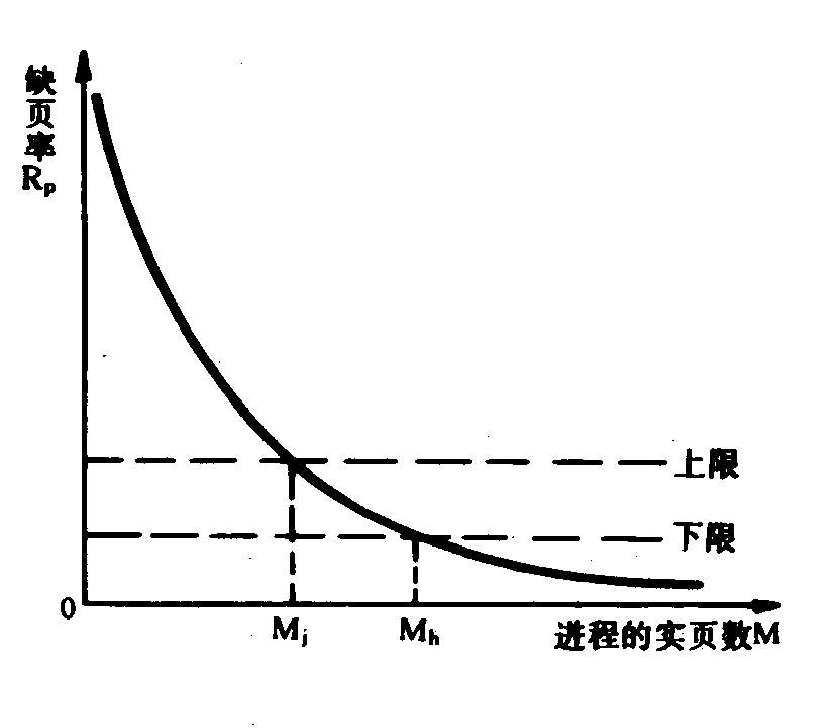缺页率与物理块数的关系
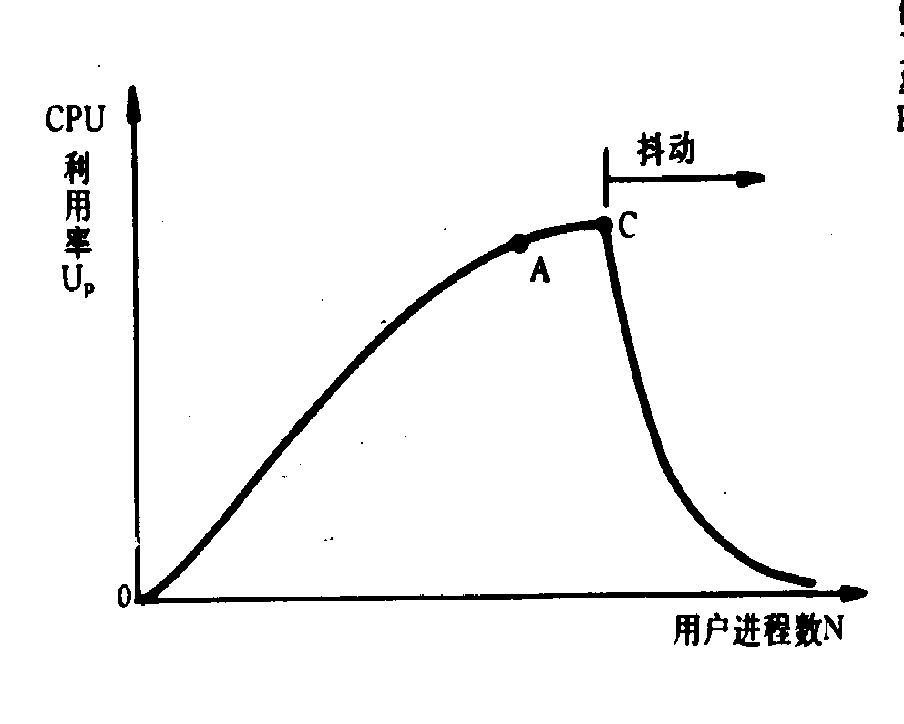CPU 利用率曲线
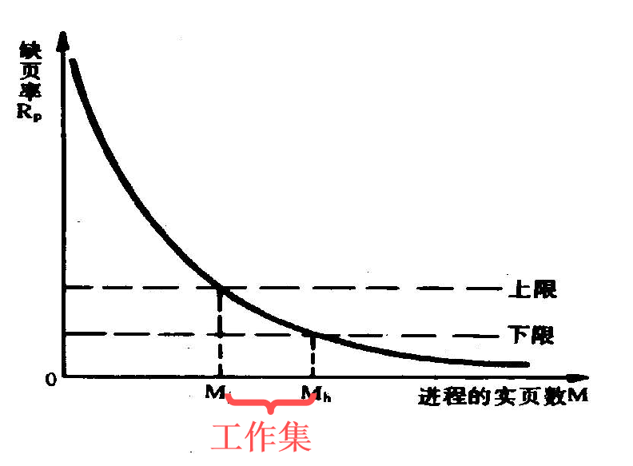
### 产生“抖动”现象原因
系统本身的原因：
1.由于内存中进程数过多，或系统中大型进程过多。
2.为进程分配的实页面数太少，也即为进程分配的内存少于进程的工作集。
3.页面置换算法不好。

进程本身的原因：
  出现质量低劣的“无簇聚性”程序，即在一个映象中频繁而絮乱地出现递延寻址访问操作数或控制流的循环转移情况。


# 五、设备管理
外设按功能分为IO设备和存储设备

## IO系统组成
IO系统由IO设备、设备控制器、总线或通道组成

### 控制方式
**四种执行IO的技术：**
  - **程序控制IO**（可编程IO方式/忙等方式）：CPU 代表进程向I/O模块发送命令，然后进入忙等待，操作完成后继续进行
  - **中断驱动IO**：CPU 代表进程向I/O模块发送命令，
    - 如果I/O指令是非阻塞的就继续进行
    - 否则当前进程阻塞，调度其他进程。
  - **直接内存访问（DMA）**：允许外设绕过 CPU 直接修改内存的一种带中断的技术。
  - **IO通道方式**

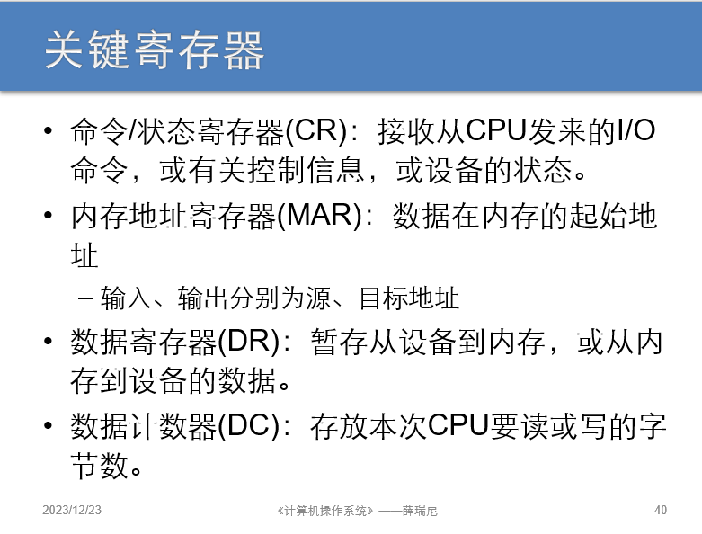
中断驱动IO方式不适用于块设备：过于频繁的中断。DMA将数据从设备直接送入内存，CPU只在传输开始和结束进行干预。

### IO设备
1. **按传输速率分类**：低俗设备（如键盘鼠标）、中速设备（如打印机）、高速设备（如磁带机、光盘机）
2. **按设备的共享属性分类**：独占设备（在一段时间只允许一个进程访问的设备）、共享设备（在一段时间允许多个进程同时访问的设备）、虚拟设备（使用虚拟技术，将一台独占设备变为逻辑上的多台设备）
3. **按信息交换单位分类**：块设备（信息存取以数据块为单位，属于有结构设备）、字符设备（信息存取以字符为单位，属于无结构设备）
### 设备控制器
设备控制器是CPU与设备之间的接口，接收CPU的命令，控制设备工作，实现IO设备和计算机之间的数据交换

### IO通道
**通道（Channel）** — 也称 I/O处理机。
是为了减轻CPU的工作负载，在 CPU 与设备控制器之间而设置的一种专门用于 I/O 的简单处理机。
是一个独立于 CPU 的专管I/O控制的处理机

**IO通道是对 DMA 的发展：**
  - 以一个数据块为单位的读写，改进为一组数据块为单位的读写
  - 可以做到一个通道控制多台设备，需要的 CPU 干预也更少
  - 可以实现 CPU、通道、IO设备三者的并行操作，提高整个系统的资源利用率

**通道指令系统** — 也称通道控制字（CCW），是通道能够独立执行的I/O指令。

#### “瓶颈”问题
通道昂贵少量，若被占用则会因通道不足产生 **“瓶颈”**，造成系统吞吐量下降
解决方法是增加设备到主机间的通路而不增加通道，采用多通路系统。即把一个设备连接到多个设备控制器，把一个控制器连接到多个通道
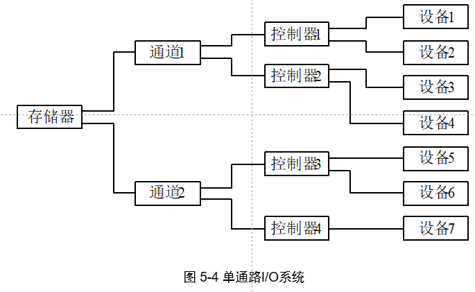
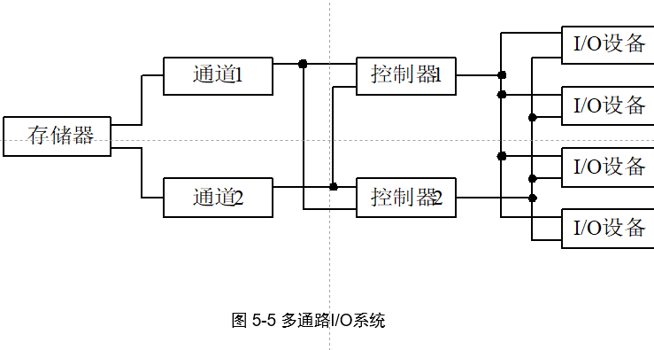## 中断
**中断(interrupt)** 指cpu对IO设备发来中断信号后的响应。
中断源向cpu发送中断请求，，cpu暂停正在执行的程序，保存cpu现场环境后，转去执行该IO设备的中断处理程序。执行完后回到断点，继续执行原来的程序。中断是由外部设备引起的
**陷入(trap)** 指由cpu内部事件如运算上溢下溢、程序出错、电源故障等导致中断。称为内中断/软中断/陷入。与外中断区别是信号来源不同。


## 缓冲
缓冲技术的基本思想：在内存中开辟一个或多个专用区域（缓冲区），作为CPU与I/O设备间信息的集散地。

**好处：**
1、缓解CPU与外设速度不匹配的问题。
2、减少CPU中断响应次数，放宽响应时间。
3、提高CPU与I/O设备，I/O设备之间的并行操作能力。

### 缓冲区的组织
假定IO设备输入缓冲区的时间$T$，OS将缓冲区中数据传送到工作区时间$M$，CPU处理时间$C$。
#### 单缓冲区
$T$与$C$可以并行，系统对每块数据处理时间  $max[C，T]+M$
#### 双缓冲区
对于生产者和消费者，他们使用缓冲区的时候必须互斥使用。如果消费者还没有取走，即使生产者又生产出新的数据也无法送入，需要等待。此时便可设置两个缓冲区。
若$C+M > T$，CPU不必等待输入； 若$C+M < T$ ，可使设备连续输入。
系统处理时间  $max[C+M，T]$。
#### 循环缓冲/环形缓冲
当输入输出速率相差不大可采用双缓冲，当两者速度相差甚远则可引入多缓冲区。
#### 缓冲池
管理多个缓冲区，一般将具有相同类型的缓冲区连接成一个队列。形成空白缓冲队列（空缓冲区）、输入队列（装满输入数据）、输出队列（装满输出队列）

为使各进程能互斥地访问缓冲池队列、可为每一队列设置一个互斥信号量MS(type), 初值为1。此外，为了保证各进程同步地使用缓冲区，可为每个缓冲队列设置一个资源信号量RS(type)表示缓冲区数，初值为n。既可实现互斥又可保证同步的Getbuf过程和Putbuf过程描述如下。 

    void Getbuf(unsigned type){
      wait(RS(type));  //P(RS)
      Wait(MS(type));  //P(MS)
      B(number)=Takebuf(type);
      V Signal(MS(type));  //V(MS)
    }

    void Putbuf(type, number){
      Wait(MS(type));  //P(MS)
      Addbuf(type, number);
      Signal(MS(type));  //V(MS)
      Signal(RS(type));  //V(RS)
    }

## 磁盘
### 磁盘结构
- 磁盘设备可包括一或多个物理盘片，每个磁盘片分一个或两个**存储面(surface)**
- 每个磁盘面被组织成若干个同心环，这种环称为**磁道(track)**
- 每条磁道逻辑上划分成若干个**扇区(sectors)**
- 不同盘面相同的磁道称为**柱面(cylinder)**
- 读写头分为**固定头**和**移动头**，固定头在每条磁道上都有一个，速度快、成本高；而移动头只在每个盘面上有一个，结构简单、成本低
- 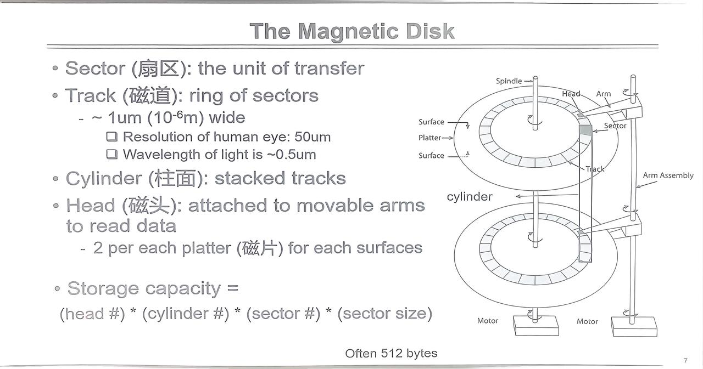
- 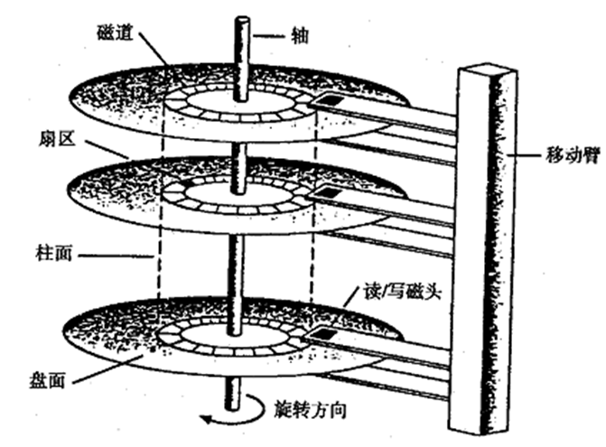

### 磁盘计算
- 寻道时间\(T_s\)：在磁头可移动系统中，将磁头臂移动到指定磁道所需的时间
- 旋转延迟\(T_r=\frac{1}{2r}\)：将待访问的扇区移动到磁头位置所花的时间，其中\(r\)表示转速
  - 旋转延迟时间最长为\(\frac{1}{r}\)，最短为 0，平均下来就是为\(\frac{1}{2r}\)
- 传输时间\(T_t=\frac{b}{rN}\)：向硬盘传输/取数据的时间，其中\(b\)表示字节数，\(N\)表示一个磁道包含的字节数
- 磁盘访问时间\[T_a=T_s+T_r+T_t\]

> 例题
考虑一个典型的磁盘，平均寻道时间为4ms，转速为7500r/m，每个磁道有500个扇区，每个扇区有512个字节。假设有一个文件存放在2500个扇区上估算下列两种情况下读取该文件需要的时间。
(1)2500个扇区分别位于5个相邻磁道上，且文件按扇区顺序存放
(2)2500个扇区随机分布

> 解答
第一问由于连续存储，只需要考虑一开始的寻道时间，也就是\[T_s+5(T_r+T_t)\]，其中\[T_r=\frac{1}{2r}=4\operatorname{ms}\]按平均计算，\[T_t=\frac{1}{r}=8\operatorname{ms}\]按一圈计算，共\(64\operatorname{ms}\)。
第二问需要一个扇区一个扇区地读，每个扇区都要重新计算：\[T_s=4\operatorname{ms},~T_r=4\operatorname{ms},~T_t=\frac{1}{500}\cdot\frac{1}{r}=0.016\operatorname{ms}\]
总时间就是\[2500(T_s+T_r+T_t)=20040\operatorname{ms}\]。
### 工作过程
大容量磁盘（固定头磁盘）：磁盘的每条磁道上都有一个读/写磁头，并行读/写。
中小型磁盘设备（活动头磁盘）：每个盘面配置一个磁头，串行读/写。
为了读／写某磁道、某扇区的数据，首先让磁头移动，寻找指定磁道，再旋转磁盘将相应扇区定位到磁头下面。

访问磁盘时间中寻道占比时间最长，相应进行优化
### 磁盘调度（寻道）算法
**1、先来先服务（FCFS）** 按照申请服务的先后次序。未考虑寻道优化。
**2、最短寻道优先算法（SSTF）** 优先选择离磁头最近的请求。未考虑磁头来回摆动。可能出现老进程的“饥饿”现象。
**3、扫描算法（SCAN）** 又称为：电梯法。自外向内后又自内向外。既考虑请求与磁头的距离，又考虑磁头移动的方向。偏爱最靠里和最靠外的请求

**4、循环扫描算法（C-SCAN）** 规定磁头单向移动，即将最小磁道号与最大磁道号构成循环，进行循环扫描。


# 六、文件管理
# 七、用户接口
